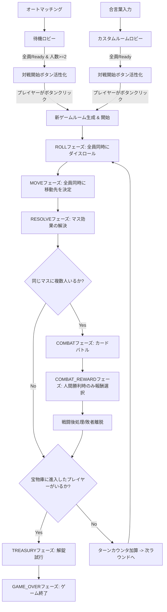

# ArachnoFair (アラクノフェア) 開発設計書

本ドキュメントは、蜘蛛の巣状のフィールドを舞台とした数理探索・リソース管理・カードバトルゲーム「アラクノフェア」のシステムアーキテクチャ、データモデル、通信プロトコル、およびゲームロジックの実装指針を定義するものである。

---

## 1. プロジェクト概要
- **ゲームコンセプト**: 極座標系の蜘蛛の巣状マップを探索し、情報隠蔽された2進法パズルを解きながら、戦闘カードを用いたバースト戦を勝ち抜き、中央の「宝物庫」の解錠を目指すリアルタイム対戦ボードゲーム。
- **アーキテクチャモデル**: Node.js/Express/Socket.ioによるサーバー主導のゲームステート管理と、Vite/HTML5/SVGによるサイバーパンク調ダークネオンUIを用いたフロントエンド描画の密結合リアルタイム通信モデル。
- **マルチプレイモデル**: 誰とでも対戦できる「オートマッチング」および、任意の合言葉を指定して特定の仲間と遊べる「カスタムルーム（パスキーロビー）」の両方に対応。
- **ゲーム開始トリガー**: 全員準備完了時に自動開始するのではなく、待機ロビー内の条件を満たした時点で「対戦開始 (Start Game)」ボタンが活性化し、プレイヤーが手動で対戦を開始できるトリガーモデルを採用。

---

## 2. 技術スタック
- **フロントエンド (Client)**: 
  - HTML5, CSS3 (Vanilla CSS, ダークテーマ・ネオン発光エフェクト)
  - SVG (動的な極座標系マッピングによる蜘蛛の巣型トポロジーの描画)
  - JavaScript (ES6+ Vanilla, Vite環境)
  - Socket.io-client
- **バックエンド (Server)**:
  - Node.js, Express (静的ファイル配信)
  - Socket.io (WebSocket双方向接続によるマッチングおよびリアルタイム同期)
- **ゲームロジック (Shared/Core)**:
  - `gameLogic.js` (純粋関数型に近いゲーム進行、AI意思決定、数理計算)

---

## 3. ディレクトリ構造と主要ファイルの役割

```text
ArachnoFair/
├── package.json               # プロジェクト設定および共通依存関係
├── README.md                  # 開発設計書 (本ファイル)
├── manual.md                  # 操作指南書 (ユーザー向けルール)
├── backend/
│   ├── package.json           # バックエンド依存関係 (express, socket.io)
│   ├── server.js              # HTTP/WebSocketサーバー、ルーム管理、ゲーム進行解決
│   └── gameLogic.js           # マップ接続定義、ダイス、探索、戦闘、2進法算出ロジック
└── frontend/
    ├── package.json           # Viteフロントエンド設定
    ├── index.html             # UIレイアウト (マップ、ステータス、戦闘、オペレーション)
    ├── vite.config.js         # Vite設定
    └── src/
        ├── main.js            # Socket.ioクライアント、SVGマップ動的描画、DOMイベント制御
        └── style.css          # デザインシステム (サイバーパンク/ネオンエフェクト)
```

---

## 4. ゲーム進行とフェーズ状態遷移

ゲームはルーム単位の**「全員同時進行ターン制 (Phase-based Synchronization)」**で制御される。



---

## 5. 詳細ゲームロジック設計

### ① 蜘蛛の巣マップ (極座標系トポロジー)
- 全34ノード（0〜33）で構成され、同心円状の4つのリング構造を持つ。
  - **中心 (ノード 0)**: 宝物庫 (`TREASURY`)
  - **リング 1 (ノード 31-33)**: 内周
  - **リング 2 (ノード 25-30)**: 中内周
  - **リング 3 (ノード 13-24)**: 中外周
  - **リング 4 (ノード 1-12)**: 外周（スタート地点）
- 接続関係は `gameLogic.js` の `MAP_CONNECTIONS` にて静的に定義。
- マスのタイプ (`NODE_TYPES`) は、`ITEM`, `EVENT`, `MODIFIER`, `TRAP` が開始時にランダムにシャッフルされて配置される（ノード 0 のみ `TREASURY` 固定）。

### ② 2進法パズル解錠ロジック
- ゲーム開始時に、1〜15 of範囲の秘密の**基礎値 $B$** が決定される。
- 各プレイヤーの固有の**目標値 $N$** は以下の計算式で求められる。
  $$N = B (\text{基礎値}) + \text{役職補正} + \text{アイテム補正}$$
  - **役職補正**: 石油王・魔女は $+3$
  - **アイテム補正**: 指輪・アミュレット・王冠の3種が揃っていると $-2$（トレジャーハンターは $-3$）
  - クランプ処理: $1 \le N \le 15$
- **進入条件**: 宝物庫（マス 0）へ着地した際、所持金糸数が $N$ のONビット数（例: $12 = 1100_2$ の場合、8と4の位がONなので必要数は 2）以上であること。不足時は HP $-300$ を受け、外周〜中周へ弾かれる。
- **解錠判定**: `8`, `4`, `2`, `1` のスロットへの金糸のON/OFF割り当ての合計値が $N$ と完全一致すること。一致すれば即勝利。不一致時は HP $-600$ のダメージを受け、投入金糸は消失、内周（31〜33）へ弾かれる。

### ③ 累積バースト戦闘 (Combat)
- お互いの累積値を `0` から開始し、手札からカード（100〜1000の100の倍数）をプレイ。
- 累積値が **`2000` を超えた（`2001` 以上になった）瞬間にバースト**し、即敗北（HP $-500$ ）。
- **情報の曖昧化 (ito風)**:
  - 累積 0〜800: 「安全」
  - 累積 900〜1500: 「微熱」
  - 累積 1600〜2000: 「過熱」
  - 累積 2001以上: 「臨界点 (バースト)」
- **人間勝利時の報酬選択肢**:
  - `loot`: 相手の装備アイテムをランダムに1つ略奪（トレジャーハンターはさらに戦闘カードを1枚補充）。装備なし時はデフォルト報酬（金糸1本強奪、金糸なし時はHP 300吸収）を処理。
  - `destroy`: 相手の手札（戦闘カード）の最大値から2枚までを破壊。手札なし時はデフォルト報酬を処理。

### ④ 確率の罠対策 (擬似乱数ドロー補正)
- プレイヤーがイベントマスやアイテムマスで探索に失敗する（ハズレを引く）たびに、プレイヤーオブジェクトの `missCount` がインクリメントされる。
- 次回のドロー成功確率は、基本確率に `missCount * 0.2` (イベント) または `missCount * 0.15` (アイテム) を加算して算出され、偏りによるストレスを緩和する。成功時に `missCount` は `0` にリセットされる。

---

## 6. 通信プロトコル仕様 (WebSocket Event API)

### サーバー受信イベント (Client -> Server)
#### 【オートマッチング用】
- `queue:join`: プレイヤー登録とマッチングロビーへの参加要求。
  - Payload: `{ name: string, role: string }`
- `queue:ready`: ロビー内での準備完了状態の切り替え要求。
- `queue:leave`: ロビーからの退出。
- `queue:start-match`: 待機プレイヤーが2名以上かつ全員準備完了時の対戦開始要求。
- `queue:start-immediate`: 即時ゲーム開始要求 (CPUによる穴埋め)。

#### 【カスタムルーム用】
- `custom-room:join`: 合言葉を用いた特定ルームへの作成・参加要求。
  - Payload: `{ roomName: string, playerName: string, role: string }`
- `custom-room:ready`: カスタムルーム内での準備完了状態の切り替え。
  - Payload: `{ roomName: string, ready: boolean }`
- `custom-room:leave`: カスタムルームからの離脱要求。
  - Payload: `{ roomName: string }`
- `custom-room:start-match`: カスタムルーム内の全員が準備完了時の対戦開始要求。
  - Payload: `{ roomName: string }`

#### 【ゲームプレイ用】
- `game:join`: マッチング成功後のゲームルームへの接続要求。
  - Payload: `{ roomId: string }`
- `game:roll`: ダイスロールの要求。
- `game:move`: 移動先マスの確定要求。
  - Payload: `{ node: number }`
- `combat:play`: 戦闘時のカードプレイまたはパス要求.
  - Payload: `{ cardValue: number }` (パス時は 0)
- `combat:flee`: 戦闘からの逃走要求。
- `reward:claim`: 戦闘勝利時の報酬クレーム要求（人間専用）。
  - Payload: `{ choice: 'loot' | 'destroy' }`
- `treasury:unlock`: 宝物庫の解錠試行。
  - Payload: `{ slots: { '8': boolean, '4': boolean, '2': boolean, '1': boolean } }`
- `treasury:cancel`: 宝物庫からの引き返し（内周へ移動）。

### クライアント受信イベント (Server -> Client)
#### 【ロビー・マッチング】
- `queue:update`: 通常ロビー内の参加人数および全参加者の準備ステータス更新。
  - Payload: `{ count: number, players: Array<{ name: string, role: string, ready: boolean }> }`
- `custom-room:update`: カスタムルーム内の参加メンバーおよび各々の準備ステータス更新。
  - Payload: `{ roomName: string, players: Array<{ name: string, role: string, ready: boolean }> }`
- `custom-room:error`: カスタムルーム処理において満員エラーなどが発生した際の通知。
  - Payload: `{ message: string }`
- `match:success`: マッチング成功およびアサイン情報の通知。
  - Payload: `{ roomId: string, playerId: number }`

#### 【ゲームプレイ】
- `game:state`: 同期用ゲーム状態のブロードキャスト。
  - Payload: `gameState` オブジェクト（`players`, `phase`, `turnCount`, `logs`, `combatState`, `nodeTypes`等を含む）

---

## 7. AI (CPU) の意思決定アルゴリズム

### ① 移動意思決定 (Movement Heuristics)
- **最優先**: 宝物庫（マス 0）が到達可能かつ金糸を2本以上所持している場合、即座に 0 を選択。
- **役職特性 (石油王)**: 攻撃的な強奪を行うため、到達可能な選択肢に他のプレイヤーが滞在しているマスがあれば最優先でそこに向かう。
- **イベント/アイテム優先**: それ以外は `EVENT` マス、次いで `ITEM` マスを優先的に選別し、残りはランダムで移動。

### ② 戦闘意思決定 (Combat Heuristics)
- 手札から `累積値 + カード値 <= 2000` を満たす「安全なカード」を抽出。
- 安全なカードが存在しない場合は、バースト回避のため自動的に「パス (0)」を選択。
- **性格補正 (トレジャーハンター/魔女)**: 攻撃指針AIとして、抽出された安全なカード群の中から「最大値」のカードをプレイ（臨界点ギリギリを狙う）。
- **通常AI (冒険家/エンジニア/石油王)**: 相手の累積値を上回るために必要な最小のカードを選択。上回るのが不可能な場合は、手札内の「最小値」のカードを消費して温存に努める（「5本のきゅうり」のロジック）。
